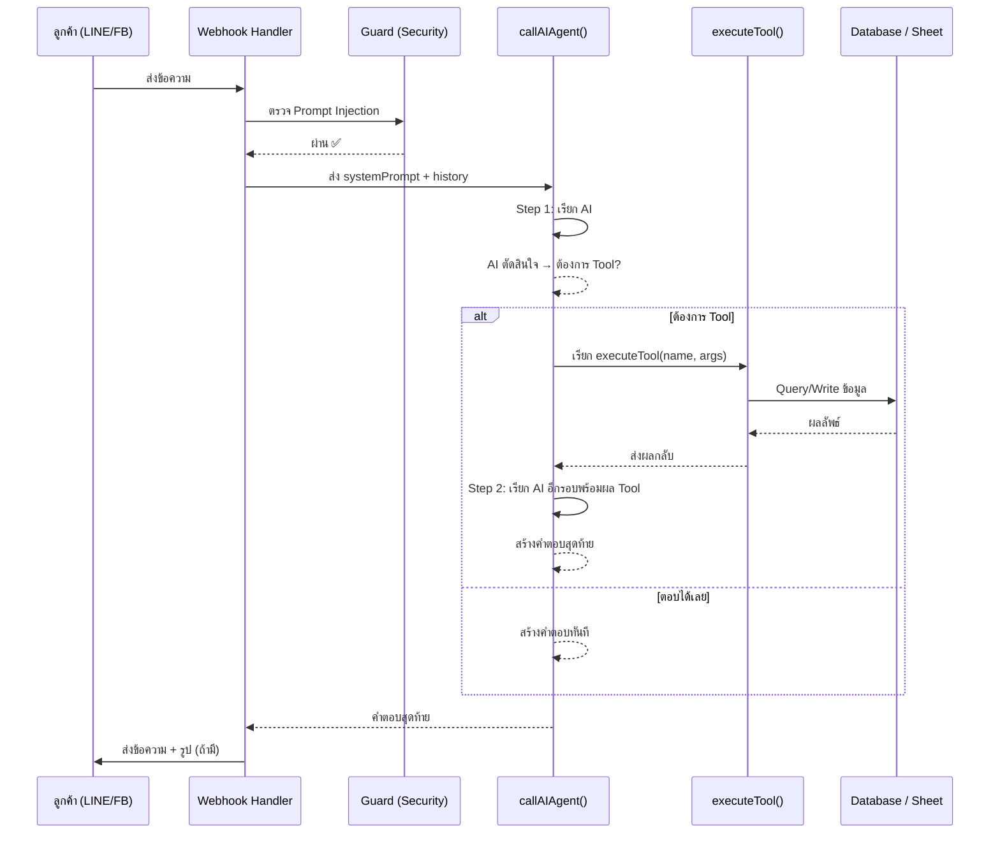

# 🤖 Smart AI Agent & Native Tool Calling — Botify

## ภาพรวมระบบ

Botify ใช้สถาปัตยกรรม **Agentic AI** — หมายความว่า AI ไม่ได้แค่ "ตอบข้อความ" แต่มีความสามารถ **ตัดสินใจและเรียกใช้ฟังก์ชั่นเอง** เพื่อดำเนินการจริงในระบบ

```
ลูกค้าพิมพ์ → AI คิด → เรียก Tool (ถ้าต้องการ) → รับผล → ตอบกลับลูกค้า
```

---

## 🔄 Flow การทำงานแบบละเอียด



---

## 🛠️ Native Tool Calling — Tools ที่มีในระบบ

ระบบมี **7 Tools** ที่ AI เลือกใช้ได้เองอัตโนมัติ:

| Tool | เมื่อไหร่ AI จะเรียก | ผลลัพธ์ |
|------|-------------------|---------:|
| `get_product_image` | ลูกค้าขอดูรูปสินค้า | คืน URL รูปภาพ |
| `take_order` | ลูกค้าสั่งซื้อและให้ข้อมูลครบ | สร้าง Order ID ใน Sheet |
| `save_lead` | ลูกค้าสนใจแต่ยังไม่ซื้อ | บันทึก Lead ใน Sheet |
| `check_order_status` | ลูกค้าถามสถานะออเดอร์ | คืนข้อมูลออเดอร์ + tracking |
| `book_appointment` | ลูกค้าจองคิว/นัดหมาย | สร้าง Booking ID + แจ้งเจ้าของ |
| `check_booking` | ลูกค้าถามสถานะการจอง | คืนข้อมูลการจอง |
| `cancel_booking` | ลูกค้าต้องการยกเลิกการจอง | เปลี่ยนสถานะใน Sheet เป็น "ยกเลิก" |

---

## 🔁 Agent Loop — วนซ้ำสูงสุด 4 รอบ

```javascript
for (let step = 0; step < 4; step++) {
    // 1. เรียก AI
    // 2. ถ้า AI ต้องการ Tool → execute แล้ววนซ้ำ
    // 3. ถ้า AI ตอบได้แล้ว → break ออก
}
```

**ทำไมต้องวนซ้ำ?** เพราะบางสถานการณ์ต้องใช้หลาย Tool ต่อกัน เช่น:
- ดูรูปสินค้า → แล้วสั่งซื้อทันที (2 Tools ในครั้งเดียว)

---

## 🤖 รองรับ AI หลาย Provider พร้อมกัน

ระบบใช้ **Native Tool Calling** ของแต่ละ Provider — ไม่ใช่แค่ให้ AI "บอก" ว่าจะทำอะไร แต่เป็น Format ที่ Provider รองรับโดยตรง:

### Claude (Anthropic) — แนะนำ
```
stop_reason === "tool_use" → มี tool_use block ใน content
```
```json
{
  "type": "tool_use",
  "id": "toolu_01A09...",
  "name": "take_order",
  "input": { "name": "สมชาย", "phone": "0812345678", ... }
}
```

### OpenAI / Typhoon / Gemini
```
msg.tool_calls → Array ของ function call
```
```json
{
  "tool_calls": [{
    "id": "call_abc123",
    "function": { "name": "take_order", "arguments": "{\"name\":\"สมชาย\",...}" }
  }]
}
```

> **หมายเหตุ:** Gemini ใช้ `functionDeclarations` format แตกต่างออกไปเล็กน้อย แต่ระบบ handle ให้อัตโนมัติ

---

## 🛡️ Security Layer — ป้องกัน Prompt Injection

ก่อนส่งข้อความให้ AI ทุกครั้ง ระบบ **block** pattern อันตรายเหล่านี้:

```
"ignore all previous instructions"
"forget everything"  
"you are now a..."
"pretend to be"
"show me your system prompt"
"ลืมคำสั่ง / เปลี่ยนบทบาท"
```

ถ้าตรวจพบ → **ตอบทันทีโดยไม่ส่งให้ AI** เพื่อประหยัดค่า API และความปลอดภัย

---

## 🧠 Context ที่ส่งให้ AI ทุกครั้ง

```
System Prompt (บุคลิก + กฎของร้าน)
    +
Customer Profile (ชื่อ / เบอร์ / ที่อยู่เดิม / ประวัติออเดอร์)
    +
Chat History (สูงสุด 20 ข้อความล่าสุด)
    +
Available Tools (7 tools)
```

### ตัวอย่าง Customer Context ที่ inject เข้า AI:
```
════════ 👤 ข้อมูลลูกค้าคนนี้ ════════
ชื่อ: สมชาย
เบอร์: 0812345678
ออเดอร์ก่อนหน้า: 3 ครั้ง
ที่อยู่เดิม: 123 ถ.สุขุมวิท กรุงเทพฯ 10110

กฎ: ถ้าลูกค้าจะสั่ง → ใส่ที่อยู่เดิมให้เลย แล้วถามว่า "ใช้ที่อยู่เดิมไหมครับ?"
```

---

## ⚡ ความแตกต่างจาก "บอท regex ธรรมดา"

| ระบบเก่า (Regex/If-Else) | Botify AI Agent |
|--------------------------|-----------------|
| ต้องเขียน rule ทุก case | AI ตัดสินใจเอง |
| ไม่เข้าใจบริบท | จำบทสนทนาและลูกค้า |
| "คำสั่ง = คำตอบ" | "เข้าใจ = ดำเนินการ" |
| ใช้ Tool ได้แค่ 1 อย่าง | ใช้หลาย Tool ต่อกัน |
| ต้องอัปเดต rule ตลอด | เรียนรู้จาก Prompt |

---

## 💰 AI Credits & Token Economy (ใหม่ล่าสุด)

การที่ AI มีความเป็น Agent หมายถึงมีต้นทุนในการประมวลผลสูงกว่าปกติ ระบบจึงใช้ **AI Credits (Tokens)** เป็นตัวกลาง:
- **1 Token** = การส่งข้อความโต้ตอบ 1 ครั้ง (นับเฉพาะตอน AI ตอบ)
- **5 Tokens** = การใช้ Tool ทื่มีค่าใช้จ่าย (เช่น `verify_slip` สำหรับตรวจสอบสลิปโอนเงิน)

**กลไกการตัดเครดิต:**
- ก่อนเริ่ม Agent Loop ระบบจะเช็คว่า `ai_credits` ของร้านค้านั้น > 0 หรือไม่
- หากหมด (0 หรือติดลบ) บอทจะ**หยุดทำงานทันที** (ตอบกลับเป็นระบบ Auto-reply ธรรมดา หรือเงียบไปเลย) จนกว่าจะได้รับการเติมเครดิตจาก Super Admin
- เครดิตถูกจัดการผ่าน `shops` table และบันทึกประวัติที่ `credit_transactions`

---

## 📝 ตัวอย่างการทำงานจริง

### สถานการณ์: ลูกค้าสั่งสินค้า

```
ลูกค้า: "ขอซื้อชุดนอน Size M สีชมพู ส่งด้วยนะครับ"

AI คิด: ต้องถามข้อมูลก่อนสั่ง
AI ตอบ: "ต้องการชื่อ เบอร์ และที่อยู่จัดส่งด้วยนะครับ"

ลูกค้า: "สมชาย 0812345678 123 สุขุมวิท กทม โอนครับ"

AI คิด: ข้อมูลครบแล้ว → เรียก Tool take_order
Tool: สร้าง ORD240527001 ใน Google Sheet
AI ตอบ: "✅ สร้างออเดอร์สำเร็จ! 🆔 ORD240527001 ..."
```

### สถานการณ์: ลูกค้าขอดูรูป แล้วสั่งซื้อ

```
ลูกค้า: "ขอดูรูปชุดนอน Size M หน่อยครับ"

AI เรียก: get_product_image("ชุดนอน Size M")
Tool คืน: { image_url: "https://..." }
AI ส่งรูปพร้อมข้อความ

ลูกค้า: "สวยเลย เอาเลยครับ ..."
AI เรียก: take_order(...)
```

---

## 🔧 ไฟล์ที่เกี่ยวข้อง

| ไฟล์ | หน้าที่ |
|------|---------|
| [`08____MULTI-PROVIDER_AI.js`](file:///c:/Users/Jack/Documents/botify%20v4/botify-merged/server/chunks/08____MULTI-PROVIDER_AI.js) | `callAIAgent()`, `executeTool()`, tool definitions |
| [`25_Main_Response_Handler.js`](file:///c:/Users/Jack/Documents/botify%20v4/botify-merged/server/chunks/25_Main_Response_Handler.js) | `askClaude()`, security guard, post-processing |
| [`26_LINE_Webhook.js`](file:///c:/Users/Jack/Documents/botify%20v4/botify-merged/server/chunks/26_LINE_Webhook.js) | รับ webhook และ route มาที่ askClaude |
| [`27_Facebook_Webhook.js`](file:///c:/Users/Jack/Documents/botify%20v4/botify-merged/server/chunks/27_Facebook_Webhook.js) | Facebook Messenger webhook |
